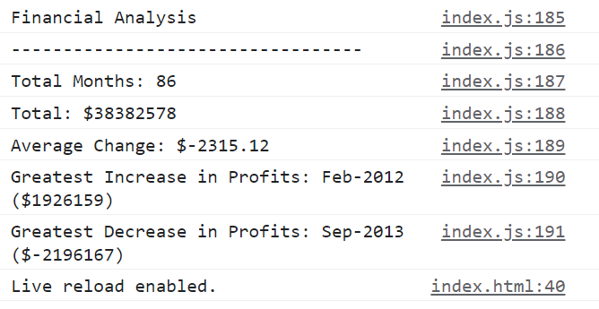

# Console-Finances
Using Javascript to analyse a multidimensional array

## Description

The aim of the project is to use Javascript to write code which analyses a multidimensional array in order to find:

1. The total number of months included in the dataset.
2. The net total amount of Profit/Losses over the entire period.
3. The average of the changes in Profit/Losses over the entire period.
4. The greatest increase in profits (date and amount) over the entire period.
5. The greatest decrease in losses (date and amount) over the entire period.

It then should print these values to the console, roughly following the format below:

Financial Analysis
----------------------------
Total Months: 25
Total: $2561231
Average  Change: $-2315.12
Greatest Increase in Profits: Feb-2012 ($1926159)
Greatest Decrease in Profits: Sep-2013 ($-2196167)

## Installation

N/A

## Usage

The way to use the deployed application is to check the console, to view what has been printed to it. You can also view the Javascript code in the console if necessary. 

## Screenshot Of Deployed Application

## Credits

N/A

## License

Please refer to the license in the repo (MIT License).
